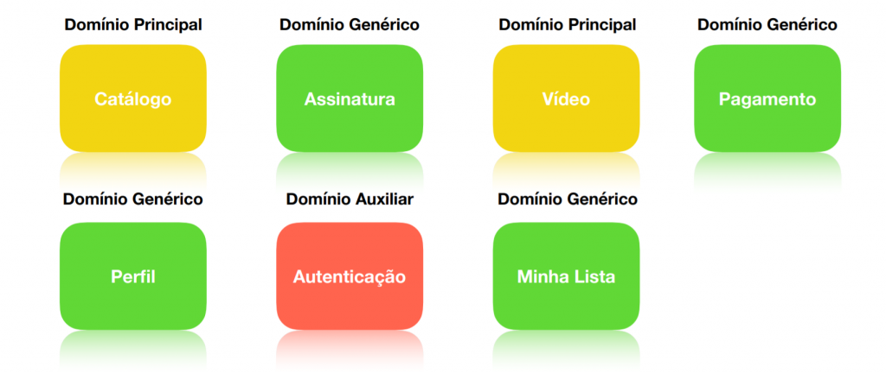
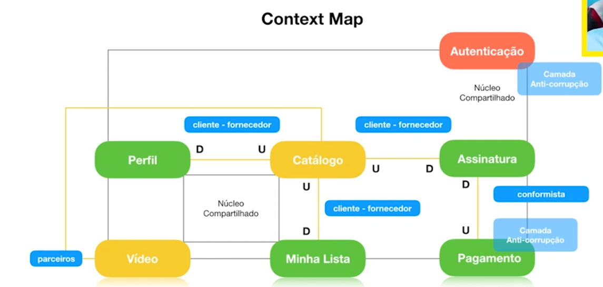
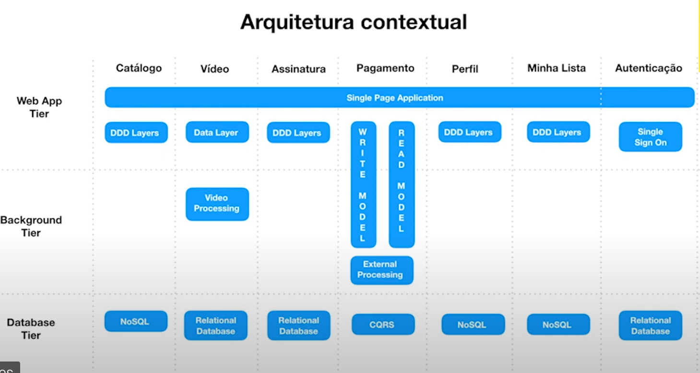
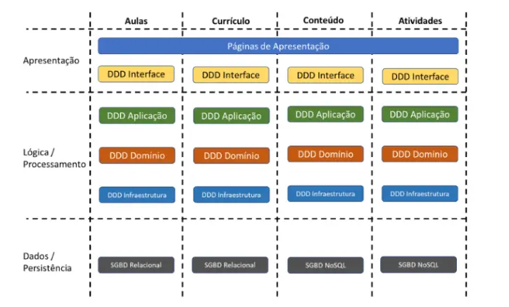
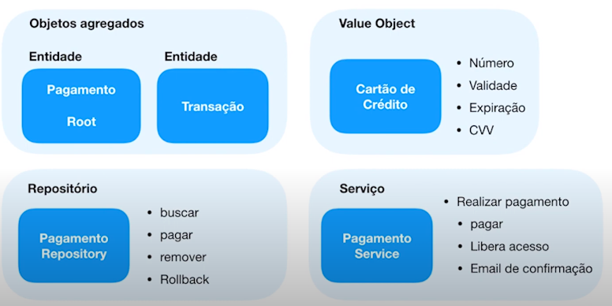
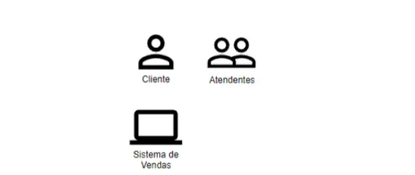
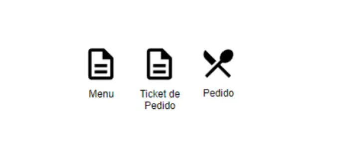
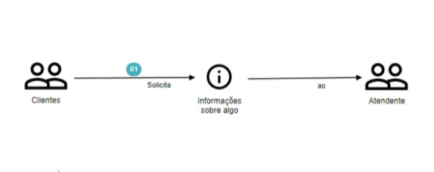
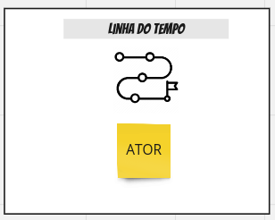
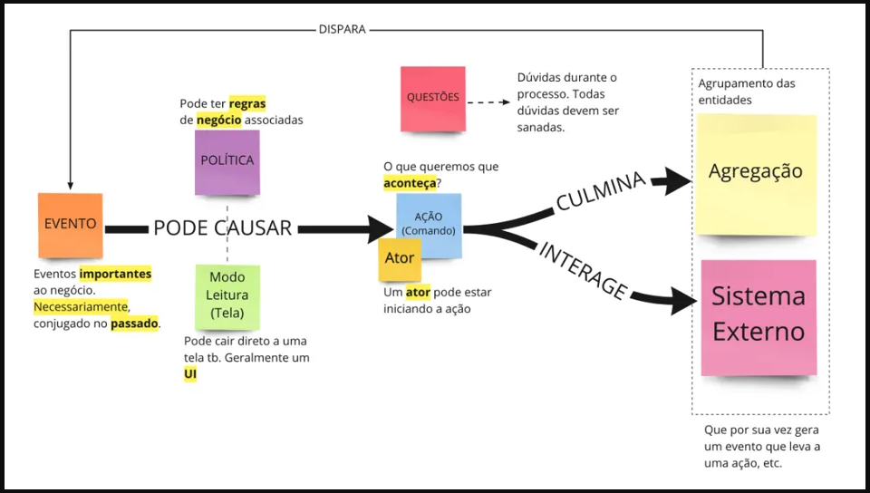

 
<h1 align="center"> Domain Driven Design </h1>
<h4 align="right"> Algo tão filosófico quanto técnico. </h4>

<h2 align="justify"> "É um conjunto de princípios com foco em domínio, exploração de modelos de formas criativas e definir e falar a linguagem Ubíqua, baseado no contexto delimitado" </h2>
 
<h2 align="center"> Domínio </h2>
<h3> É o coração do negócio, o principal motivo dele existir. </h3>
<h2 align="center"> Exploração de modelos criativos </h2>
<h3> É fazer parte do processo de entender o negócio e todos os seus modelos nos mais diversos ângulos, tendo contato direto e constante com os <i>Domain Expert</i>. </h3>
<h4>Domain Experts são pessoas totalmente envolvidas ao negócio, que dominam a área a ser explorada pelo dev, para obtenção de informações pontuais e especialistas. </h4>
<h2 align="center"> Definir e falar a linguagem Ubíqua </h2>
    <h3> É a linguagem(terminologias) falada no cotidiano, realidade e ambiente do contexto do negócio.</h3>
 
 
<h1>Pilares DDD</h1>
<dl>
    <dt><b> Linguagem Ubíqua </b></dt>
        <dd>Devs + Experts de negócio = linguagem Ubíqua </dd>
        <dd>Definir um glossário </dd>
        <dd>Dicionário de palavras a serem utilizadas por todos </dd>
         
    <dt><b> Bounded Contexts </b></dt>
        <dd>Delimita os contextos da aplicação</dd>
        <dd>Responsabilidades claramente definidas</dd>
        <dd>Cada contexto pode ter sua linguagem Ubíqua</dd>
        <dd>Cada contexto vai ter um <i>domain expert</i> que auxilia na criação de histórias e levantamento de escopo</dd>
         
        <dd><b>Modelagem estratégica</b></dd>
        <ul>
            <li>Domínio Principal -> é o motivo da aplicação existir, característica principal do negócio;</li>
            <li>Domínio Genérico -> faz com que o domínio principal funcione, ajuda em todo o processo. Geralmente funciona por ele mesmo(genérico);</li>
            <li>Domínio Auxiliar -> da suporte aos domínios genéricos.</li>
            

            <figure>
            
            <figcaption>Exemplo de dominio de uma plataforma de streaming</figcaption>
            </figure>
        

        </ul>
         
    <dt><b> Context Maps </b></dt>
        <dd>É um mapa a partir do contexto e modelagem.  Exemplo:</dd>
                 
        

            <figure>
            
            <figcaption>amarelo: Domínio Principal, verde: Domínio Genérico, vermelho: Domínio Auxiliar</figcaption>
            </figure>
        

         
        <dd>- Núcleo Compartilhado - Classes, interfaces, soluções, métodos em comum</dd>
        <dd>- <b>Fornecedor(Upstream)</b> manda no relacionamento com o <b>cliente(Downstream)</b></dd>
        <dd>- Conformista é quando um subdominio precisa se conformar com a maior complexidade de outro. Quando o cliente precisa aceitar como o fornecedor faz a solução</dd>
        <dd>- Domínios principais são parceiros de outros domínios principais.</dd>
        <dd>- <i>Anti-Corruption Layer</i> - Camada Anti-corrupção - é uma layer que faz comunicação com sistemas externos ou fora do controle da aplicação, para que possa traduzir</dd>
        <dd>- <i>Open-Host Service</i> - Serviço de Host Aberto - camada de integração onde o fornecedor(U) disponibiliza conteúdo de maneira padronizada aos clientes(D), e permite que se conectem usando um protocolo pré-definido.
        </dd>
        <dd>- <i>Published Language</i> - Linguagem publicada - Além de ter o serviço aberto de host, também tem a adequação a linguagem do cliente. Podendo ser diferentes linguagens por cliente
        </dd>
        <dd>- Caminhos separados - Representa soluções diferentes para o diferentes subdominios, caminhos separados implica em duplicação de solução, possivelmente em times diferentes</dd>
             
            <dt><i>DDD Layers / DDD Archtecture</i></dt>
             
            <dd><i>Presentation</i></dd>
            <ul>
                <li>Interface do Usuário (GUI)</li>
                <li>Interface de Linha de Comando (CLI)</li>
                <li>APIs integrações com outros sistemas</li>
            </ul>
            <dd><i>Application</i></dd>
            <ul>
                <li>Realiza a lógica de negócio</li>
                <li>Aplica a tratavita e redirecionamento das informações para as camadas correspondentes (Dominio)</li>
            </ul>
            <dd><i>Domain</i></dd>
            <ul>
                <li>É onde estão as regras de negócio</li>
                <li>Provê as informações para a camada de persistencia(Infraestrutura)</li>
            </ul>
            <dd><i>Infrastructure</i></dd>
            <ul>
                <li>É a camada que abstrai toda parte técnica</li>
                <li>Da suporte as outras camadas</li>
            </ul>
             
        

            <figure>
            
            <figcaption>Eixo X -> Subdominios / Eixo Y -> Camadas da aplicação</figcaption>
            </figure>
        
 
        

            <figure>
            
            <figcaption>Eixo X -> Subdominios / Eixo Y -> Camadas da aplicação</figcaption>
            </figure>
        

         
        <dd><b>Domain Model Patterns</b> - São padrões de desenvolvimento e estruturação de aplicações, onde o domínio é o principal foco.</dd>
         
        

            <figure>
                
            </figure>
        

         
        <ul>
            <li>Focado em Entidades de Agregadores, <i>Entities and Aggregate Objects</i>, desconhece a camada de banco de dados;
        </li>
            <li>Objetor de valor - <i>Value Objects</i> 
            <code>Endereco endereco = new Endereco("street", 100, "neighborhood", "city", "country")</code>
                <ul>
                    <li>Imutáveis</li>
                    <li>Coleção de atributos</li>
                    <li>Normalmente não possuem setters</li>
                    <li>Entrada de valores por construtor</li>
                    <li>Tipagem forte</li>
                    <li>Possibilidade de validar dados no construtor do objeto</li>
                </ul>
            </li>
            <li>Repositórios - <i>Repositories</i>
                <ul>
                    <li>Tem acesso direto a camada de dados</li>
                    <li>Persiste dados utilizando as entidades</li>
                    <li>Métodos de consultas</li>
                    <li>Cria-se repositório por agregador, não por entidade</li>
                    <li>Pode consultar diretamente serviços externos</li>
                    <li>Possibilidade de validar dados no construtor do objeto</li>
                </ul>
            </li>
            <li>Serviços de Dominio
                <ul>
                    <li>Implementam a lógica de negócios de acordo com as definições de um domain expert</li>
                    <li>Trabalham com diversos fluxos e diversas entidades e agregações</li>
                    <li>Utilizam repositórios como interface de acesso aos dados</li>
                    <li>Consomem recursos da camada de infraestrutura</li>
                </ul>
            </li>
        </ul>
         
</dl> 

 
<h1 align="center"> Domain Storytelling </h1>
<h4 align="right"> Forma fácil e gráfica de representar uma narrativa de domínio, pela perspectiva de um atuante. </h4>

<h3 align="justify"> Nos ajudará a entender o domínio, estabelecer uma linguagem ubíqua, evitar mal-entendidos, esclarecer requisitos de software, estruturar e implementar software corretamente, desenhar processos. </h3>
 
<h2>Linguagem Pictográfica</h2>
<dl>
    <dt><b> Atores - <i>Actors</i></b></dt>
        <dd>Um ator ou atores</dd>
        <dd>Pode ser uma pessoa, um grupo de pessos, um objeto ou um sistema</dd>
         

            <figure>
            
            </figure>
        

     
    <dt><b> Objetor de trabalho - <i>Work Objects</i></b></dt>
        <dd>São objetos utilizados pelos atores</dd>
        <dd>Pode ser documentos, objetos, interações físicas ou digitais</dd>
        

            <figure>
            
            </figure>
        

     
     <dt><b> Atividades - <i>Activities</i></b></dt>
        <dd>São as ações dos atores com os objetos de trabalho</dd>
        

            <figure>
            
            </figure>
        

     
    <dt><b> Números sequênciais - <i>Sequence Numbers</i></b></dt>
        <dd>Indicam o fluxo da história</dd>
     
    <dt><b> Anotações - <i>Annotations</i></b></dt>
        <dd>São Informações que são importantes</dd>
        <dd>Para detalhamento, para fluxo, para gatilhos de ações ou eventos</dd>
     
    <dt><b> Grupos - <i>Groups</i></b></dt>
        <dd>Representam parte da história</dd>
        <dd>Como ações repetidas, subdomínios, limitações, processos, etc</dd>
     
    <dt><b> Cores - <i>Colors</i></b></dt>
        <dd>Trazem ênfase e organização</dd>
     
    <dt><b> Escopo atual vs Escopo desejado</b></dt>
        <dd>Escopo atual representa exatamente a historia do fluxo de negócio, o escopo desejado inclui possiveis mudanças ou melhorias que não são reais, ou ainda não foram implementados</dd>
    <dt><b> Domínios puros e domínios digitalizados</b></dt>
    <dd>Detalhes das atividades feitas de maneira natual, dentro da realidade do fluxo. Digitalizado inclui as tecnologias utilizadas.</dd>
        <dt><b>Equipe de trabalho</b></dt>
        <ul>
            <li>Domain Expert vai contar a história</li>
            <li>Ouvintes quaisquer interessados</li>
            <li>Moderador vai conduzir as conversas e manter dentro dos assuntos de interesse</li>
            <li>Modelador irá desenhar os fluxos das histórias na linguagem adequada e com anotações</li>           
        </ul>
         
</dl>
 
<h1 align="center"> Event Storming </h1>
<h4 align="right"> Visa ser leve e dinâmico, 
utiliza-se de ferramentas didaticas como postits, papeis, cards coloridos </h4>

<h2 align="justify"> Reunião essencial para identificar melhor os elementos do DDD. É um método baseado em workshop para descobrir rapidamente o que está acontecendo no domínio de um programa de software </h2>

 
<ul>
    eventos
    <ul>
        <li>
        algo que aconteceu e as pessoas se importam
        </li>
        <li>
        sempre no passado, pode ser cronometrado, resultado de algo importante        
        </li>
        <li>
        são gerados através de sistemas, telas, politicas e até outros eventos  
        </li>
        <li>
        eventos são definidos por domain experts
        </li>
    </ul>
    comandos
    <ul>
        <li>
        inverso do evento
        </li>
        <li>
        ação iniciada pelo ator, sempre no presente        
        </li>
        <li>
        para todo evento há um comando realizado  
        </li>
    </ul>
    linha do tempo
    <ul>
        <li>define os acontecimentos cronologicamente</li>
        <li>sempre possui um ator envolvido</li>
        <li>envolve um evento e um comando</li>
    </ul>
    

            <figure>
            
            </figure>
        

    modelo de leitura
    <ul>
        <li>
            pode gerar um comando
        </li>
        <li>
            geralmente uma tela, board, papel, notificação qualquer lugar que exiba informações
        </li>
    </ul>
    politica
    <ul>
        <li>
            são regras e definições que geram comandos ou eventos
        </li>
    </ul>
    sistemas externos
    <ul>
        <li>
            são integrações ou ações de sistemas fora do nosso domínio
        </li>
    </ul>
    aggregate
    <ul>
        <li>
            é um <i>cluster</i> (conjunto) de objetos importantes para o dominio, entidades relacionadas
        </li>
    </ul>
</ul>
 

            <figure>
            
<figcaption>
            <a href="https://miro.com/app/board/o9J_kpZJAAE=/" rel="board example" target="_blank">
    <b>example board</b>
</a>
            </figcaption>
            </figure>
        

