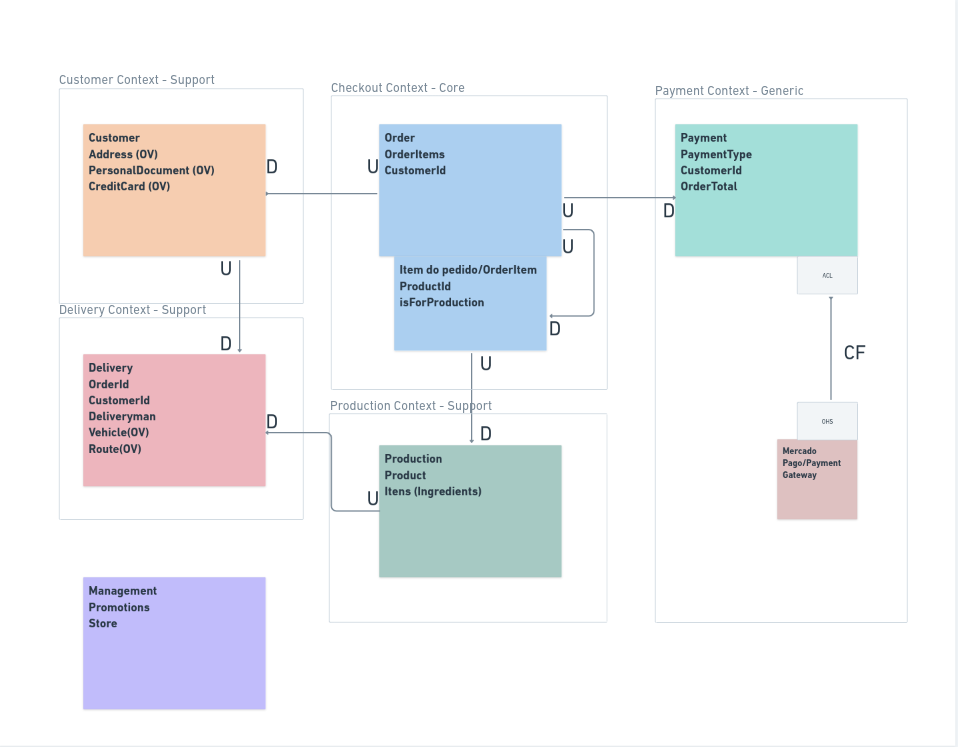
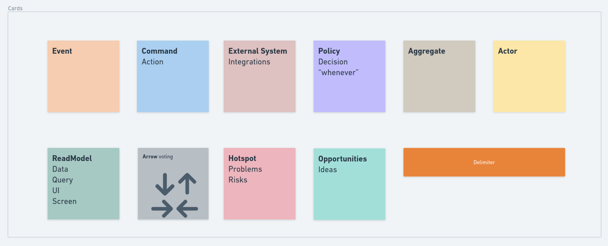
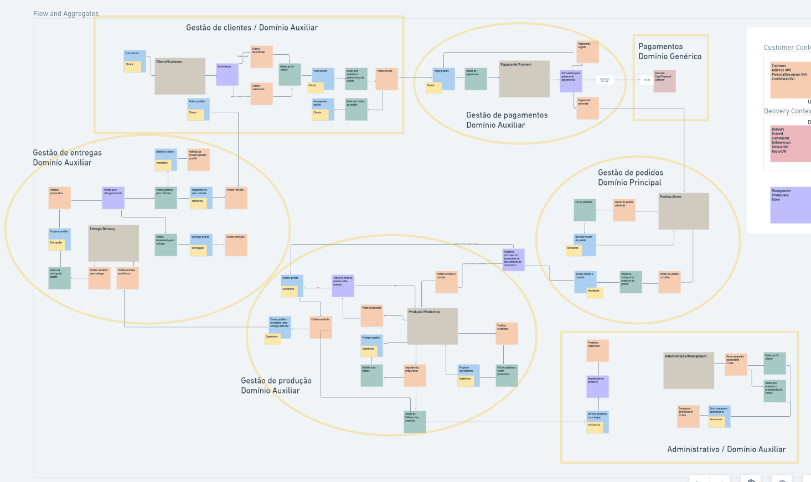

# _Domain-Driven Design_ - DDD

#### É algo teórico e conceitual.

### São princípios para modelar um _software_ a partir do domínio que é o coração do negócio. A partir desse modelo são separadas as regras, processos e complexidades para depois desenvolver a solução de maneira organizada.

- Criado por **Eric Evans** em 2003 com o livro principal sobre o assunto;
- Deve ser aplicado em grandes soluções, _softwares_ complexos onde há muitos contextos, regras, departamentos e pessoas;
- Grande parte da complexidade vem da comunicação, separação de contextos e entendimento do negócio.

### Nos ajuda

- Entender domínios e subdominios:
  - É entender o negócio e todos os seus modelos nos mais diversos ângulos, tendo contato direto e constante com os _Domain Experts_.
- Criar linguagens ubíquas:
  - É a terminologia falada no cotidiano, realidade e ambiente do contexto do negócio.
  - Definir um glossário.
- Criar _design_ estratégico -> _bounded contexts_ -> contextos delimitados:
  - Responsabilidades claramente definidas.
  - Cada contexto pode ter seu _domain expert_ e sua linguagem ubíqua.
- _Design_ tático -> _context maps_ -> mapear e agregar entidades, objetos de valor e eventos:
  - Comunicação entre os contextos delimitados.
- Entender complexidade de negócio e complexidade técnica e aplicar soluções:
  - Aplicar os _domain model patterns_. São padrões de desenvolvimento e estruturação de aplicações, onde o domínio é o principal foco.

##### _Domain Experts_ são pessoas totalmente envolvidas ao negócio, que dominam a área a ser explorada pelo dev, para obtenção de informações pontuais e especialistas.

<br>

> "In short, DDD is primarily about modeling a Ubiquitous Language in an explicity Bounded Context."

> "Resumindo, DDD é primeiramente sobre modelar uma linguagem ubíqua em um contexto delimitado explícito."

<br>

---

### _Core Domain_

- domínio principal, razão do negócio existir;
- diferencial de mercado e competitivo;
- alta complexidade de negócio;
- alta influência de negócio.

### _Support Subdomain_

- apoia o domínio;
- torna o domínio possível;
- tem uma alta influência de negócio;
- baixa complexidade de negócio.

### _Generic Subdomain_

- sistemas auxiliares;
- sem diferencial competitivo;
- facilmente substituiveis;
- baixa influência de negócio;
- baixa complexidade de negócio;
- _softwares_ de plateleira são um exemplo.

<br>

---

<br>

### Processo de Problema para Solução

#### Problema

- Visão geral do domínio e suas complexidades -> subdominios

#### Solução

- Análise e modelagem dos domínios/subdominios -> contextos delimitados

<br>

---

<br>

### _Bounded Context_ - Contexto delimitado

> "A Bounded Context is an explicit boundary within which a domain model exists. Inside the boundary all terms and phrases of the Ubiquitous Language have specific meaning, and the model reflects the Language with exactness"

> "Um Contexto demilitado é um limite explícito dentro do qual um modelo de domínio existe. Dentro desse limite, todos os termos e frases da Linguagem Ubíqua possuem significados específicos, e o modelo reflete a Linguagem com precisão."

<br>



<br>

---

<br>

### _Context Mapping_ - Mapeamento de contextos

#### Visão estratégica e modelagem estratégica.

**Contextos**:

1. Checkout
2. Customer
3. Payment
4. Delivery
5. Production
6. Management

<br>

### Definições

- **Partnership** - relação de parceria entre contextos, geralmente entre _core domains_.
- **Shared kernel** - núcleo compartilhado -> compartilham funcionalidades ou funções.
- **Customer-Supplier** - relação onde um contexto consome recursos e outro fornece, respectivamente.
- **Downstream** - (D) - consome o serviço - se adapta ao modo de comunicação.
- **Upstream** - (U) - fornece o serviço e diz como será a comunicação.
- **Conformist** -> Conformista - é a necessidade em se adaptar a um serviço, se conformando com a comunicação.
- **Anticorruption-layer** - (ACL) - camada anti-corrupção é uma camada de interface, _adapter_.
- **Open host service** - um contexto vai fornecer um serviço disponível a partir de algum protocolo pré definido, exemplo: APIs.
- **Publish language** -> para consumir um serviço é necessário utilizar uma linguagem pré definida: exemplo JSON.
- **Separate ways** -> rumos separados em que cada contexto usa e mantém seu prórpio padrão.
- **Big Ball of Mud** -> Grande bola de lama - monte de coisas misturadas que precisamos lidar, muito comum em códigos legados.

<br>

---

<br>

### _*Domain Model Patterns*_

- _Entities_ - entidades
- _Value Objects_ - (OV) objetos de valor
- _Repositories_ - repositórios
- _Domain Services_ - serviços de domínio

<br>

### _Entities_ - Entidades

> "Uma entidade é algo único que é capaz de ser alterado de forma contínua durante um longo período de tempo."

> "Uma entidade é algo que possui uma continuidade em seu ciclo de vida e pode ser distinguida independente dos atributos que são importantes para a aplicação do usuário. Pode ser uma pessoal, cidade, carro, ticket de loteria ou uma transação bancária."

- principal caracteristica de uma entidade é a identidade, algo único;
- pode ser alterado ao longo do caminho;
- se autovalida para manter a consistência;
- manipula o coração da aplicação, carrega as pricipais regras de negócio;
- possui atributos que foram mapeados do modelo;
- possui comportamentos - metodos expressivos do modelo;
- sempre representa o estado correto e atual do elemento.

#### entidade anêmica - apenas guarda dados (atributos), não carrega regra de negócio e não possui métodos. Exemplo: DTO - _data transfer object_.

<br>

### _Value Objects_ - Objetos de Valor

> "Quando voce se preocupa apenas com os atríbutos de um elemento de um model, classifique isso como um Value Object."

> "Trate o Value Object como imutável."

- vai além dos tipos primitivos, é um objeto que possui valor ou valores;
- se autovalida para manter a consistência;
- nao possui id, é um conjunto de propriedades(atributos).

<br>

### _Aggregates_ - Agregadores

> "Um agregado é um conjunto de objetos associados que tratamos como uma unidade para propósito de mudança de dados."

- conjunto de objetos (Entidades ou _Object Value_) que possuem vínculos;
- podem estar fortementes agregados;
- podem ter relacionamento sem estar necessáriamente agregados;
- agregador é o _root_, o objeto que comanda o relacionamento, normalmente outros objetos dependem ou se comportam de acordo com o _root_;
- se está em diferentes agregados relaciona pelo ID;
- se está dentro do mesmo agregado a relação é pelo próprio objeto.

<br>

### _Repositories_ - Repositórios

> Esses objetos semelhantes a coleções são sobre persistência. Todo tipo _Agregado_ persistente terá um Repositório. De um modo geral, existe uma relação um-para-um entre um tipo Agregado e um Repositório.

- local de armazenamento;
- cria-se repositório por agregador, não por entidade;
- possui métodos de consultas;
- tem acesso direto a camada de dados;
- pode consultar diretamente serviços externos;
- possibilidade de validar dados no construtor do objeto.

<br>

### _Domain Services_ - Serviços de Domínio

> "A Service in the domain is a stateless operation that fulfills a domain-specific task. Often the best indication that you should create a Service in the domain model is when the operation you need to perform feels out of place as a method on an Aggregate or a Value Object."

- são _stateless_, não armazenam dados ou estados;
- implementam a lógica de negócios de acordo com as definições de um domain expert;
- trabalham com diversos fluxos e diversas entidades e agregações;
- podem envolver operações em lote ou muitas entidades;
- utilizam repositórios como interface de acesso aos dados;
- consomem recursos da camada de infraestrutura, através de adapter.

<br>

### _Domain Events_ - Eventos de Domínio

> "Use um evento de domínio para capturar uma ocorrência de algo que aconteceu no domínio".

> "A essência de um evento de domínio é que você o usa para capturar coisas que podem desencadear uma mudança no estado do aplicativo que você está desenvolvendo. Esses objetos de evento são processados para causar alterações no sistema e armazenados para fornecer um _AuditLog_".

- normalmente é usado quando precisamos notificar outros _BoundedContext_ uma mudança de estado;
- quando algo aconteceu;
- todo evento deve ser representado por uma ação realizada no passado:
  - _action_-> _event_
    - _create user_ -> _user created_
    - _send email_ -> _email sent_

#### _Components_

- _Event_: dados do evento, data do evento, etc
  - o que acontece (informações do evento)
- _Handler_: executa um processamento quando um evento é chamado
  - quando o evento acontece (ação do evento)
- _Dispatcher_: armazena e executa os _handles_ para o evento
  - escuta o evento e emite as ações

```
                eventDispatcher: {
                    event: [
                        handler1(),
                        handler2(),
                        handler3()...
                    ],
                    userCreated: [
                        sendMail(),
                        notifyOtherBoundedContext(),
                    ]
                }
```

<br>

### _Modules_ - Módulos

> Em um contexto DDD, módulos servem como contêineres nomeados para classes de objetos de domínio que são altamente coesas entre si. O objetivo deve ser baixo acoplamento entre as classes que estão em modulos diferentes. Como os módulos usados no DDD não são compartimentos de armazenamento anêmicos ou genéricos, também é importante nomear adequadamente os Módulos.

- respeita a linguagem universal - ubíqua;
- baixo acoplamento;
- agregados devem estar juntos se fazem sentido;
- organizado pelo domínio/subdomínio e não por tipo de objeto;
- começa no _bounded context_
- outras camadas deve respeitar a modularização de domínio

<br>

### _Factories_ - Fábricas

> Desloque a responsabilidade de criar instâncias de objetos complexos e agregados para um objeto separado , que pode não ter responsabilidade no modelo de domínio, mas ainda faz parte do design de domínio.
> Forneça interface que encapsule toda a criação complexa e que não exija que o cliente faça referência às classes concretas dos objetos que estão sendo instanciados.
> Crie agregadores inteiros de uma única vez, reforçando suas invariantes.

- _factory method_
  - um método que faz uma chamada e cria objetos que possuem interface em comum
- _abstract factory_
  - ajuda a tomar decisão para criar famílias de objetos

<br>

<br><br><br>

# Event Storming

[Event Storming Board](https://whimsical.com/event-storming-JtGC65F4b7zDc2XfYS6gpu)

#### Visa ser leve e dinâmico, utiliza-se de ferramentas didáticas como postits, papéis, _cards_ coloridos.

### Reunião essencial para identificar melhor os elementos do DDD. É um método baseado em _workshop_ para descobrir rapidamente o que está acontecendo no domínio de um programa de _software_.

- Criado por **Alberto Brandolini**
- Acontece em forma de _workshop_
- Deve envolver os _Domain Experts_ e a área técnica
- Ajuda a entender o domínio através dos eventos gerados por ele

<hr>

### _Event_ - Evento

- verbo no passado
- relevante para os _domain experts_
- possivelmente finalizam fases
- são gerados através de:
  - comandos;
  - sistemas externos;
  - resultado do tempo;
  - consequência de politicas;
  - outros eventos.

### _Command_ - Comando

- verbo no presente
- realizado pelo ator - deve envolver um ator
- precede um evento

### Dados para tomada de decisão

- Dados necessários para tomada de decisões

> The data needed in order to make that decision

### _Policy_ - Política

- quando algo acontece (como se fosse uma tomada de decisão)
- "_whenever_"
- são gerados através de eventos
- são regras e definições que geram comandos ou eventos

### _Timeline_ - Linha do Tempo

- define os acontecimentos cronologicamente
- sempre possui um ator envolvido
- envolve um evento e um comando
- coisas podem acontecer paralelamente

### _Read Model_ - Modelo de Leitura

- consultas
- pode gerar um comando
- geralmente uma tela, board, papel, notificação qualquer lugar que exiba informações

### _External Systems_ - Sistemas Externos

- são integrações ou ações de sistemas fora do nosso domínio

### _Aggregates_ - Agregados

- é um _cluster_(conjunto) de objetos importantes para o domínio
- entidades relacionadas

### _Hotspot_ - "Ponto polêmico"

#### _Risks and Ideas_ - Riscos e Ideias

- _cards_ para:
  - riscos
  - problemas
  - ideias
  - oportunidades

#### _Arrow voting_ - Setas de votação

- utilizadas em conflitos de decisões, ações, fluxos, riscos e ideias
- uma votação através de setas apontadas para os _cards_ sugeridos

<br>



<br>

### _Flow_ - Fluxo



<br><br><br>

# Domain Storytelling

#### Forma fácil e gráfica de representar uma narrativa de domínio, pela perspectiva de um atuante.

### Nos ajudará a entender o domínio, estabelecer uma linguagem ubíqua, evitar mal-entendidos, esclarecer requisitos de software, estruturar e implementar software corretamente, desenhar processos.

<br>

---

### Linguagem Pictográfica

- _Actors_ - Atores
  - Pode ser uma pessoa, um grupo de pessos, um objeto ou um sistema
- _Work Objects_ - Objetos de trabalho
  - São objetos utilizados pelos atores
  - Pode ser documentos, objetos, interações físicas ou digitais
- _Activities_ - Atividades
  - São as ações dos atores com os objetos de trabalho
- _Sequence Numbers_ - Números sequênciais
  - Indicam o fluxo da história
- _Annotations_ - Anotações
  - São Informações que são importantes
  - Para detalhamento, para fluxo, para gatilhos de ações ou eventos
- _Groups_ - Grupos
  - Representam parte da história
  - Como ações repetidas, subdomínios, limitações, processos, etc
- _Colors_ - Cores
  - Trazem ênfase e organizaçã

---

### Escopo atual vs Escopo desejado

- Escopo atual
  - representa exatamente a história do fluxo de negócio
- escopo desejado
  - inclui possíveis mudanças ou melhorias que não são reais, ou ainda não foram implementados.

### Domínios puros e domínios digitalizados

- Puro
  - Detalhes das atividades feitas de maneira natual, dentro da realidade do fluxo.
- Digitalizado
  - inclui as tecnologias da informação utilizadas.

### Equipe de trabalho

- _Domain Expert_
  - vai contar a história
- Ouvintes
  - qualquer interessado
- Moderador
  - vai conduzir as conversas e manter dentro dos assuntos de interesse
- Modelador
  - irá desenhar os fluxos das histórias na linguagem adequada e com anotações
